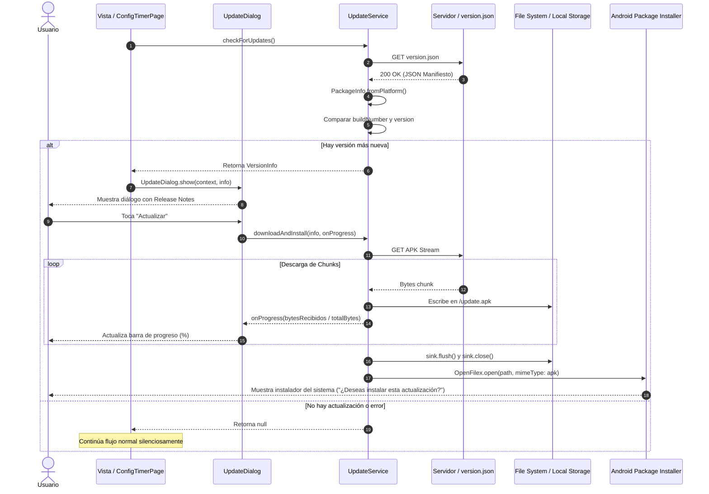

# Especificación Técnica: Feature de Actualización Automática (In-App OTA Updates)

> **Documento:** Technical Specification (Spec)  
> **Feature:** Actualización Automática In-App (Over-The-Air / Sideload APK)  
> **Plataforma objetivo:** Flutter (Android prioritario, extensible a iOS / Stores)  
> **Estado:** Aprobado / Implementado (Referencia: App Kronos)  
> **Versión del Spec:** 1.0.0  

---

## 1. Resumen Ejecutivo (Executive Summary)

Esta especificación describe la arquitectura, contrato de datos, flujo de ejecución e integración de la funcionalidad de **Actualización Automática In-App**. 

El objetivo es permitir que cualquier aplicación Flutter distribuida de forma independiente (fuera de Google Play Store, p. ej. distribución interna, entornos empresariales, betas privadas o descargas directas) pueda:
1. Consultar automáticamente si existe una versión más reciente disponible.
2. Mostrar las notas de la versión (*changelog*) al usuario en un diálogo no bloqueante (o bloqueante si se parametriza).
3. Descargar el archivo de instalación (`.apk`) mostrando una barra de progreso en tiempo real.
4. Invocar directamente el instalador de paquetes del sistema operativo.

---

## 2. Arquitectura del Módulo

El módulo sigue los principios de Clean Architecture y separación de responsabilidades:

```text
lib/features/app_update/
├── domain/
│   └── entities/
│       └── version_info.dart          # Entidad pura con lógica de comparación de versiones
├── data/
│   ├── models/
│   │   └── version_info_model.dart    # Mapeo JSON con soporte multi-entorno (flavors)
│   └── services/
│       └── update_service.dart        # Cliente HTTP, descarga por streams y llamada a OpenFilex
└── presentation/
    └── widgets/
        └── update_dialog.dart         # UI con notas de versión, barra de progreso y acciones
```

### 2.1. Entidades y Modelos

#### `VersionInfo` (Domain Entity)
Encapsula los metadatos de la versión remota y contiene la lógica de negocio para determinar si corresponde una actualización:

- **Campos:**
  - `version` (`String`): Versión semántica legible (ej. `"1.2.0"`).
  - `buildNumber` (`int`): Número incremental de compilación (ej. `4`).
  - `url` (`String`): Enlace directo de descarga del instalador (`.apk`).
  - `releaseNotes` (`List<String>`): Lista de cambios y novedades de la versión.
- **Regla de Negocio (`isNewerThan`):**
  Una versión remota es considerada más nueva si:
  $$\text{buildNumber}_{\text{remoto}} > \text{buildNumber}_{\text{local}} \quad \land \quad \text{version}_{\text{remoto}} \neq \text{version}_{\text{local}}$$

#### `VersionInfoModel` (Data Model)
Parsea el manifiesto JSON remoto según el *flavor* o ambiente configurado en la app (`prod`, `staging`, `dev`).

---

## 3. Contrato de Datos: Manifiesto Remoto (`version.json`)

El servidor o almacenamiento remoto (Dropbox, AWS S3, GitHub Releases, Firebase Storage, etc.) debe alojar un archivo JSON con la siguiente estructura:

```json
{
  "prod": {
    "version": "1.2.0",
    "buildNumber": 4,
    "url": "https://www.dropbox.com/scl/fi/xyz/app-release.apk?dl=1",
    "release_notes": [
      "Soporte para múltiples modos de tiempo",
      "Mejoras de rendimiento y corrección de errores",
      "Nuevo diseño de botones y diálogo háptico"
    ]
  },
  "staging": {
    "version": "1.2.0-beta.1",
    "buildNumber": 5,
    "url": "https://storage.googleapis.com/mi-app-staging/app-staging.apk",
    "release_notes": [
      "Prueba de nuevas alertas acústicas"
    ]
  },
  "dev": {
    "version": "1.3.0-alpha",
    "buildNumber": 6,
    "url": "https://storage.googleapis.com/mi-app-dev/app-dev.apk",
    "release_notes": [
      "Ambiente de pruebas internas"
    ]
  }
}
```

### Especificación de campos por entorno:
| Campo | Tipo | Obligatorio | Descripción |
|---|---|---|---|
| `version` | String | Sí | Versión semántica mostrada al usuario final. |
| `buildNumber` | Integer | Sí | Código numérico entero usado para la comparación de versiones. |
| `url` | String | Sí | Enlace directo al `.apk` (enlaces de Dropbox con `dl=0` se transforman automáticamente a `dl=1`). |
| `release_notes` | List&lt;String&gt; | Sí | Lista de cadenas con viñetas de novedades o correcciones. |

---

## 4. Diagrama de Flujo y Secuencia



---

## 5. Configuración y Requisitos de Plataforma

### 5.1. Dependencias (`pubspec.yaml`)

Para reutilizar esta feature en cualquier app Flutter, agregar las siguientes dependencias:

```yaml
dependencies:
  flutter:
    sdk: flutter
  
  # Acceso a versión instalada y build number
  package_info_plus: ^10.0.0
  # Peticiones HTTP y stream de descarga
  http: ^1.6.0
  # Obtención del directorio de almacenamiento temporal/externo
  path_provider: ^2.1.5
  # Apertura del archivo .apk con el MIME type adecuado
  open_filex: ^4.7.0
```

### 5.2. Permisos en Android (`android/app/src/main/AndroidManifest.xml`)

Dentro de la etiqueta `<manifest>`:

```xml
<!-- Permiso de red para consultar manifiesto y descargar APK -->
<uses-permission android:name="android.permission.INTERNET" />

<!-- Requerido para Android 8.0+ (API 26+) para permitir instalar APKs externos -->
<uses-permission android:name="android.permission.REQUEST_INSTALL_PACKAGES" />

<!-- Requerido para compatibilidad en versiones heredadas de Android -->
<uses-permission android:name="android.permission.WRITE_EXTERNAL_STORAGE" android:maxSdkVersion="28" />
```

> [!NOTE]
> `open_filex` incluye internamente la definición de un `FileProvider` en su propio manifiesto de plugin, por lo que en la mayoría de los casos no se requiere configurar un `FileProvider` manual en `AndroidManifest.xml` a menos que exista un conflicto de providers.

---

## 6. Manejo de Errores y Casos Borde (Edge Cases)

| Caso Borde | Causa Posible | Mitigación Implementada / Recomendada |
|---|---|---|
| **URL devuelve HTML en vez de binario** | Enlaces de Google Drive o Dropbox con páginas de vista previa o escaneo de virus. | `UpdateService` valida el header `content-type`. Si contiene `text/html`, aborta y lanza excepción explicativa. Soporte automático para transformar enlaces Dropbox (`dl=0` $\rightarrow$ `dl=1`). |
| **Pérdida de conectividad durante la descarga** | Red inestable o timeout. | Manejo con bloques `try-catch`. La barra de progreso se congela y no se ejecuta la apertura de un APK corrupto o incompleto. |
| **Permiso de orígenes desconocidos denegado** | Android 8.0+ exige habilitar "Instalar apps desconocidas" para la aplicación. | Al invocar `OpenFilex.open()`, el sistema operativo automáticamente guía al usuario a la pantalla de Ajustes para conceder el permiso a la app. |
| **Conflicto de firma de claves (Keystore)** | El APK instalado y el nuevo APK fueron firmados con distintos keystores (ej. debug vs release). | El sistema operativo muestra `INSTALL_FAILED_UPDATE_INCOMPATIBLE`. Asegurarse de que el pipeline de CI/CD firme con el mismo `keystore` de producción. |
| **Plataforma iOS** | iOS no permite sideloading de paquetes `.ipa` directamente. | En `UpdateService`, agregar verificación de plataforma `if (!Platform.isAndroid)` para redirigir a App Store o TestFlight URL usando `url_launcher`. |

---

## 7. Guía Paso a Paso para Reutilizar en Otra Aplicación

### Paso 1: Copiar la carpeta del feature
Copiar el directorio `lib/features/app_update/` a la nueva aplicación.

### Paso 2: Configurar la URL del Manifiesto
Configurar la URL del manifiesto en el arranque de la app o mediante la clase de configuración de entornos (`FlavorConfig` o `.env`):

```dart
FlavorConfig.instance = FlavorConfig(
  flavor: Flavor.prod,
  updateUrl: 'https://tuservidor.com/version.json',
);
```

### Paso 3: Disparar la comprobación
En el widget principal o en la pantalla de bienvenida / inicio (`initState`):

```dart
@override
void initState() {
  super.initState();
  _checkForUpdates();
}

Future<void> _checkForUpdates() async {
  final info = await UpdateService.checkForUpdates();
  if (info != null && mounted) {
    UpdateDialog.show(context, info);
  }
}
```

También se puede agregar una opción manual en el menú de "Acerca de" o "Configuración": **"Buscar actualizaciones"**.

### Paso 4: Adaptar el diseño visual (Opcional)
`UpdateDialog` en `Kronos` utiliza el tema Neumórfico/Silk (`SilkDecor`, `SilkColors`). Para proyectos con `Material 3` o diseño corporativo diferente:
- Reemplazar los contenedores personalizados por `AlertDialog` estándar o los tokens de diseño de la aplicación destino.
- Mantener intacto el contrato de datos (`info.releaseNotes`, `_progress`, `_downloading`).

---

## 8. Mejoras y Extensiones Futuras Recomendadas

1. **Actualizaciones Forzosas / Obligatorias (`mandatory_update`):**
   - Agregar un booleano `mandatory: true` en el JSON.
   - Si es mandatorio, deshabilitar la opción "Ahora no" y bloquear el cierre del diálogo (`barrierDismissible: false` y `PopScope(canPop: false)`).
2. **Soporte de Canales (Beta / Stable):**
   - Permitir al usuario seleccionar en ajustes si desea recibir versiones estables o versiones beta.
3. **Suma de Verificación (Checksum SHA-256):**
   - Incluir campo `"sha256": "..."` en el JSON para verificar la integridad del archivo APK antes de ordenar la instalación.
4. **Empaquetado como Package Interno (`melos` / Git Submodule / Flutter Package):**
   - Extraer este módulo a un package Flutter interno (ej. `shared_app_updater`) para instalarlo vía `git:` en el `pubspec.yaml` de todas las apps de la organización.
